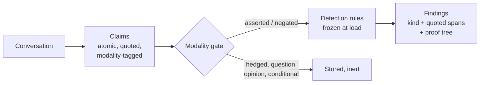
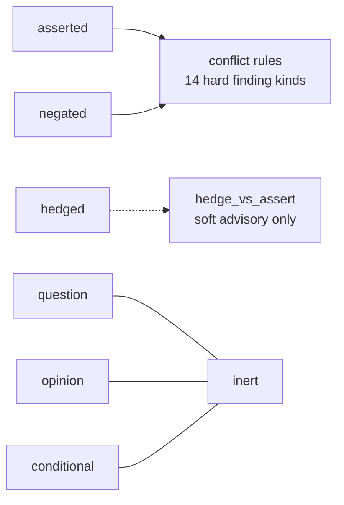
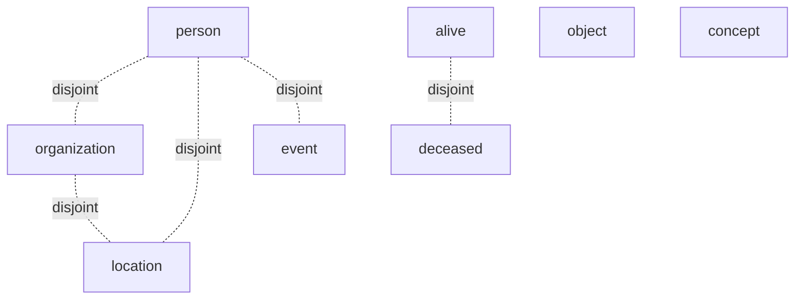
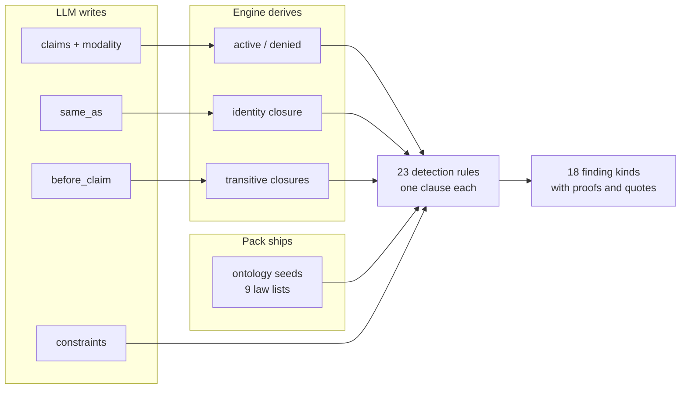

# Verified Completions

One page: what it is, how you use it, and the ontology that makes it work.

Every long conversation with an AI builds up a small world of facts, and
contradictions slip into that world silently. The user says August 14th,
later types "since we leave on the 12th", and the model books one of them
without a word. Verified Completions catches this as a matter of logic,
not opinion: the conversation is translated into facts inside a knowledge
graph, and a fixed rule pack checks whether those facts can all be true at
once. When they cannot, the finding comes with receipts:

```
functional conflict on trip.departure_date
  "flying out of Geneva on August 14th"   (message 1)
  "since we leave on the 12th"            (message 3)
```

Deterministic, repeatable, and grounded in quoted text. The model stays
fluent; the graph stays right.

## How you use it

You change one line. The gateway speaks the OpenAI chat API, so any
existing client works by pointing `base_url` at InputLayer:

```python
from openai import OpenAI
client = OpenAI(base_url="http://localhost:8080/v1", api_key="unused")

r = client.chat.completions.create(model="claude-sonnet-5", messages=[...])
print(r.choices[0].message.content)   # the normal completion
print(r.model_extra["inputlayer"])    # the consistency findings
```

Every response carries an `inputlayer.consistency` block: a status
(`verified`, `conflicts_found`, or `unverified`), and for each conflict its
kind, the two quoted spans with message indices, and the proof tree.
Three modes control behavior: `annotate` (default) attaches findings and
never blocks; `enforce` returns HTTP 422 with the findings instead of
calling the model when the prompt is corrupted; `repair` feeds the finding
back and regenerates once. There is also a standalone `POST /v1/verify`
that checks a message list without generating anything - useful for
linting system prompts in CI.

Status: the rule pack below is engine-validated and CI-enforced today; the
gateway endpoints are specified in `docs/rfc-verified-completions.md` and
land per the milestones in `PLAN.md` (#83-#87).

## How it works



The trust boundary is the design's spine: the LLM only ever writes data -
claims, orderings, constraints, identity links. The rules that decide what
counts as a contradiction are human-written and frozen before the first
message arrives. Conversation text can no more add a rule than a web form
can rewrite your database schema.

## The ontology

Everything the checker knows fits on this page: a modality gate, six
entity types, and nine small lists of laws.

### The modality gate: why hedges never false-alarm

Every claim is tagged with how strongly the speaker committed. Only two
tags can ever reach a conflict rule.



"We might leave from Lyon" and "would it be crazy to leave on the 12th?"
are stored with their quotes and can never fire anything. This is a
firewall, not a filter - the false-alarm door does not exist.

### Entity types and disjointness

Every entity gets one `is_a` type. Dashed edges are seeded as mutually
exclusive: one entity in both classes is a `disjoint_class` finding.



This is how "Acme is our supplier" followed by "the reception is at Acme,
the conference venue" gets caught: one entity, two incompatible types.

### The nine laws attributes and relations obey

Membership in each law is data - the seeds ship with the pack, and the
extractor may extend them at runtime (never override). Each law powers
exactly one rule family.

| Law | Meaning | Seeds (abridged) | Finding |
|---|---|---|---|
| Functional | one value per entity | departure_date, age, total_price, headquartered_in, member_count (+13 more; nationality deliberately absent) | `functional` |
| Inverse-functional | one entity per value | passport_number, ssn (emails and booking refs removed by review: shareable in real life) | `identity` |
| Acyclic | no loops through chains | part_of, located_in, reports_to, parent_of, ancestor_of, prerequisite_of, caused_by | `cycle` |
| Asymmetric | never both directions | parent_of, manager_of, older_than (+ north_of etc. at runtime) | `asymmetry` |
| Irreflexive | never self | parent_of, sibling_of, married_to, manager_of, distinct_from | `irreflexive` |
| Ordered pairs | start strictly before end | departure<return, birth<death, check_in<check_out, start<end (dates ride integer mirrors, YYYYMMDD) | `interval_order` |
| Bounds | plausible ranges | age 0..130, percentage <=100, total_price >=0, capacity >=0 | `range` |
| Cardinality | roster <= stated count | member_count, party_size, headcount (with has_member) | `cardinality` |
| Domains | attribute fits entity type | blood_type -> person, marital_status -> person, passport_number -> person | `domain` |

Two more corners complete the picture. Stated orderings ("the keynote is
before the workshop") accumulate into a transitive closure, so a cycle
spread across messages 2, 7, and 12 - where no pair of sentences is wrong -
is still caught; the same closure covers org charts, physical containment,
and causal chains, because they share the no-loops shape. And system-prompt
instructions are facts too: forbid clashing with require, two personas, or
a maximum below a minimum become `instruction_clash` findings before a
single token is generated.

### How data becomes findings



Identity deserves one note: "Bob" and "Robert" become one entity through a
`same_as` link that every rule looks through, and because the link is data
rather than a physical merge, a wrong merge retracts cleanly. Corrections
work the same way - "actually, make that the 14th" retracts the old fact,
and the conflict disappears with it; only an unmarked restatement is a
contradiction.

## What we can prove

The rule pack is validated on the real engine and enforced by CI on every
run. On the 1,628-scenario benchmark corpus (16 corruption families:
value, negation, temporal, spatial, causal, structural, numeric, counting,
identity, classification, instruction, plus controls), the engine detects
every planted contradiction with an exact finding-kind match - 1,526 of
1,526, deterministically, zero false kinds. In the completed behavioral
study, corrupted prompts dropped a frontier model's sound outputs from 95%
to 87%, and attaching the InputLayer finding restored 98% - with corrupted
system prompts the standout (17% sound alone, 93% with the finding).

## Prompt integrity: the same engine, pointed at the runtime

consistency-core asks whether a conversation's facts can all be true at once. Its
extension `rules/prompt-integrity.iql` asks whether a system prompt and the runtime
it is bound to can both be right at once: the tool registry, data schema, output
contract, and policy invariants load as trusted EDB facts (operator data, exactly
like the ontology seeds — prompt text can never write them), demonstrated examples
become a third origin beside conversation and output, and eighteen new finding kinds
cover phantom tools, schema drift, rule-violating examples, deleted mandatory rules,
and guardrail weakening — each with verbatim spans and proof trees, engine-validated
in `examples/iql/43_prompt_integrity/`. One ontology, layered: tool calling is new
fact relations in the same graph, not a second pack. Design and corpus mapping:
`docs/prompt-integrity.md`.

## Where to go deeper

- `docs/ontology.md` - the researcher-grade spec: extraction contract,
  type system, and every verification rule verbatim
- `docs/rfc-verified-completions.md` - the full design and API
- `rules/consistency-core.iql` - the rule pack, readable top to bottom
- `extraction/fact-lifecycle-prompt.md` - the translation contract
- `poc/` - the benchmark corpus, harness, verification ledger, results
- `docs/COVERAGE-AUDIT.md` - what logic can and cannot resolve, honestly
- `docs/prompt-integrity.md` + `rules/prompt-integrity.iql` - the prompt-vs-runtime
  extension: trusted world layer, deontic directives, examples as an origin
- `../../blog/consistency-ontology.md` - the gentle build-it-yourself tour
